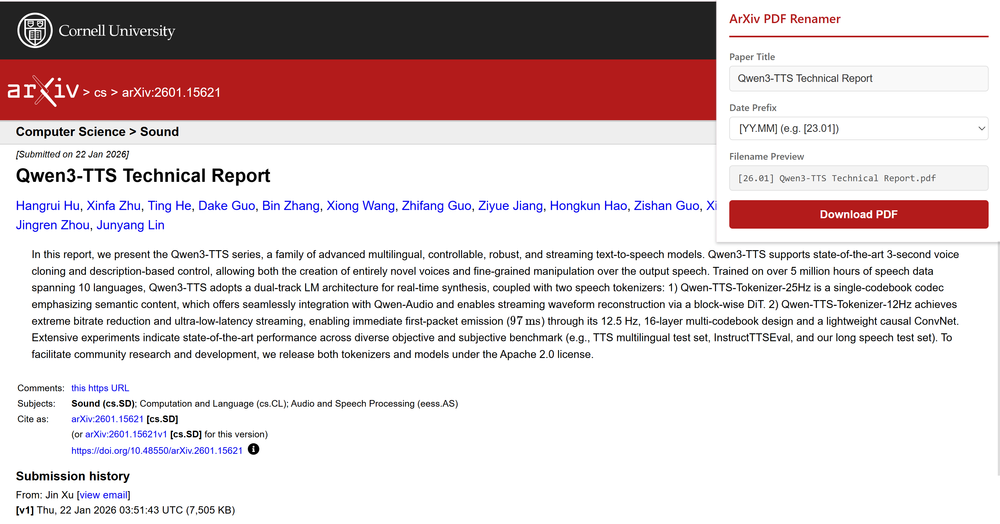

# ArXiv PDF Renamer

> [한국어 버전](README.md)

When downloading papers from ArXiv, files are saved with their ID as the filename (e.g., `2301.07041.pdf`). This Chrome extension lets you save PDFs with the paper's **actual title** as the filename.



## Features

- Automatically extracts paper title from ArXiv abs/pdf pages
- Downloads PDF using the title as the filename
- **Date prefix support**: Prepend publication date in `[YYYY.MM]` or `[YY.MM]` format (e.g., `[2023.01] Attention Is All You Need.pdf`)
- Prefix preference is saved automatically and persists across sessions
- Supports modern format (`2301.07041`) and legacy format (`hep-th/9901001`)
- Handles versioned URLs (`2301.07041v2`)

## Installation

1. Clone this repository:
   ```
   git clone https://github.com/YOUR_USERNAME/arxiv-pdf-renamer.git
   ```
2. Open `chrome://extensions` in Chrome.
3. Enable **Developer mode** in the top right corner.
4. Click **Load unpacked**.
5. Select the cloned folder.

## Usage

1. Navigate to an ArXiv paper page (abs or pdf).
2. Click the ArXiv PDF Renamer icon in the browser toolbar.
3. The paper title is automatically displayed.
4. Choose a date prefix format from the **Date Prefix** dropdown:
   - `[YYYY.MM]` — e.g., `[2023.01] Paper Title.pdf` (default)
   - `[YY.MM]` — e.g., `[23.01] Paper Title.pdf`
   - `None` — title only, no date prefix
5. Click **Download PDF** to save the file with the selected filename format.

## Supported URL Formats

| Format | Example |
|--------|---------|
| Modern abs | `arxiv.org/abs/2301.07041` |
| Modern pdf | `arxiv.org/pdf/2301.07041` |
| PDF extension | `arxiv.org/pdf/2301.07041.pdf` |
| With version | `arxiv.org/pdf/2301.07041v2` |
| Legacy | `arxiv.org/abs/hep-th/9901001` |

## License

[MIT](LICENSE)
